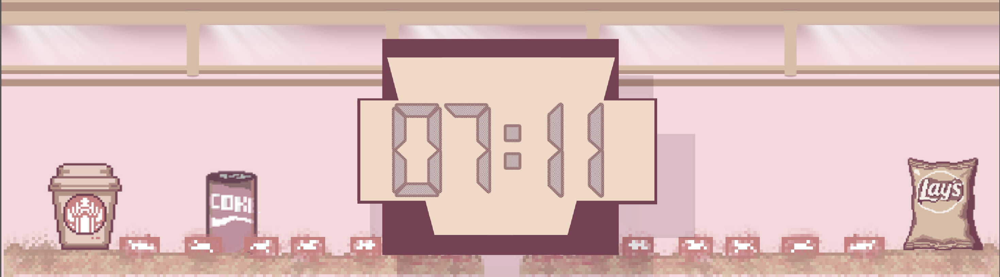
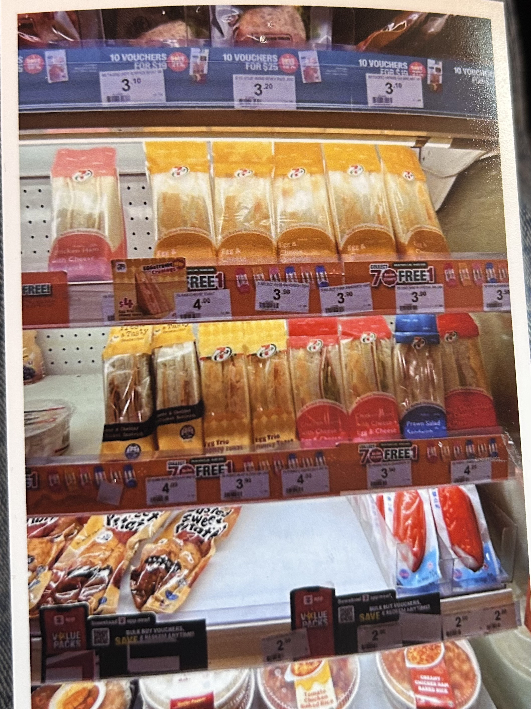

# 07:11

**07:11** is a 2D platforming speedrun game made during **Hack Club Horizons Arcana** hackathon in 48 hours by **Dashun Feng, Fizza Fatima, and Avanthika Saravanan**.

[Play 07:11 on itch.io](https://dashun090909.itch.io/0711)

Inspired by the event's randomly assigned photo prompt, you play as an adorable cat racing through a convenience store to complete a randomized grocery shopping list as quickly as possible. Every run presents a different combination of items, encouraging players to optimize their route and improve their time.

## How to Play

1. Choose a difficulty.
2. Memorize your shopping list.
3. Navigate around shelves and obstacles to find each item.
4. Collect every requested item.
5. Finish as quickly as possible and beat your best time!
6. 
## Features

- Play as an adorable cat
- Randomized grocery shopping lists
- Collect items throughout the store
- Time-based speedrunning gameplay
- A different experience every playthrough

## Motivation

The game was created for the **Hack Club Horizons Arcana** hackathon and was inspired by the event's randomly assigned photo prompt. We wanted to transform the familiar experience of shopping in a convenience store into a fast-paced platforming challenge centered around route optimization and replayability.

## Built With

- **Engine:** Godot (GDScript)
- **Artwork:** Canva & Pixilart

All game assets were created by our team. No AI-generated assets were used.
